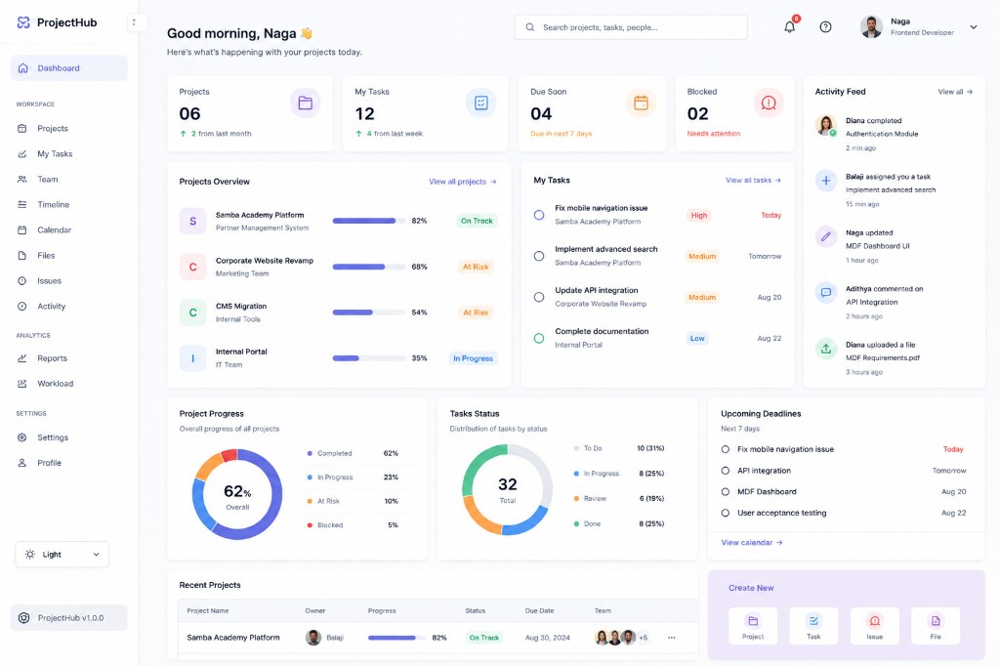

# ProjectHub

Project Management Workspace

## Overview

ProjectHub is an internal project management workspace for teams. It covers the full delivery loop: sign in, review the dashboard, open a project, assign work, move tasks across a Kanban board, track timeline and files, manage the team, report issues, and read activity and reports.

This is a production-style React capstone: feature-based architecture, a reusable design system, real REST APIs, authentication, role-based access, and consistent loading, empty, and error states.

## Problem

Teams often track projects, tasks, and blockers across disconnected tools. Status gets stale, ownership is unclear, and there is no single place to see progress, workload, and recent activity.

## Solution

ProjectHub keeps project work in one workspace:

- Managers create projects, assign people, and watch health.
- Developers update tasks, comment, upload files, and report issues.
- Everyone sees the same dashboard, timeline, and activity stream.

## Features

- Email/password authentication with protected routes
- Role-based permissions (`project:create`, `task:update`, `team:manage`, `reports:view`, and more)
- Dashboard with live stats, charts, activity, and recent projects
- Project CRUD with search, filters, and pagination
- Nested project workspace: Overview, Tasks, Timeline, Files, Team, Issues, Activity
- Kanban board with drag-and-drop and optimistic updates
- Task details with subtasks and comments
- Personal task list grouped into Today, Upcoming, Overdue, and Completed
- File upload/download, issue tracking, and chronological activity
- Global search with 300ms debounce
- Notifications with unread count and mark-as-read
- Reports and workload charts
- Profile and settings (notifications, theme, timezone)
- Responsive layout from 320px through large desktop
- Error boundary, 404, and 403 pages

## Screenshots

The dashboard follows the attached ProjectHub design reference: light SaaS layout, indigo accent, white cards, and semantic status colors.



## Tech Stack

**Frontend:** React, Vite, React Router, TanStack Query, React Hook Form, Zod, Zustand, Axios, Recharts, @dnd-kit, CSS Modules

**Backend:** Node.js, Express, MongoDB / Mongoose, JWT, Multer

**Testing:** Vitest, React Testing Library, Playwright

## Architecture

```text
Component
  → Custom Hook
    → Feature API
      → apiClient
        → Express REST API
          → MongoDB
```

State is split on purpose:

- **Local UI state:** modals, tabs, temporary form values
- **Global client state:** auth session, theme, sidebar, toasts (Zustand)
- **Server state:** projects, tasks, issues, files, activity (TanStack Query)

## Folder Structure

```text
frontend/src/
  app/            router, providers
  components/     reusable UI, layout, feedback
  features/       auth, dashboard, projects, tasks, ...
  hooks/          shared hooks
  services/       apiClient
  store/          Zustand stores
  styles/         design tokens and global CSS

backend/src/
  controllers/    route handlers
  models/         Mongoose collections
  middleware/     auth and errors
  routes/         REST API
  seed/           realistic development data
```

## State Management

Do not put everything in global state. Pages keep modal and filter state locally. Auth and theme live in Zustand. Lists and details are fetched and cached with TanStack Query.

## API Architecture

UI components never call Axios directly. Each feature owns an `api/` module. Shared HTTP concerns (base URL, credentials, auth header, error shaping) live in `services/apiClient.js`.

## Authentication

1. User signs in at `/login`
2. Server verifies credentials and returns a JWT
3. Token is stored for the session and sent as a Bearer token
4. `/api/auth/me` loads the current user and permissions
5. Protected routes redirect guests to `/login`

Development accounts:

```text
admin@example.com       Password123!
developer@example.com   Password123!
```

## Role-Based Access

Permissions are centralized, not only hidden in the UI.

| Role | Can |
| --- | --- |
| Admin / Manager | Create, edit, and delete projects; manage team; assign and delete tasks; delete issues and files; view reports |
| Developer | View assigned projects; create/update tasks; comment; upload files; report issues; view activity |

`usePermissions()` and `hasPermission("project:create")` drive buttons and route-level checks. The API enforces the same rules.

## Responsive Design

- Desktop: persistent sidebar and multi-column dashboard
- Tablet: compact header and stacked cards
- Mobile: drawer navigation, single-column content, horizontally scrollable Kanban

## Accessibility

Semantic landmarks, labeled inputs, keyboard-closable dialogs, visible focus rings, and button elements for actions. Color is paired with text on status badges.

## Performance

Route-level lazy loading, TanStack Query caching, debounced search, pagination on large lists, and optimistic Kanban updates with rollback on failure.

## Testing

- Unit/component: Button, Input, Modal, Badge, login form
- Feature coverage for project/task status UI
- Playwright e2e: Login → Dashboard → Projects → Open project → Create task → Activity

## Installation

```bash
npm install
```

Optional local MongoDB:

```bash
docker compose up -d
```

If MongoDB is not running, the API starts an in-memory database and seeds it automatically.

## Environment Variables

Copy `.env.example` to `.env`:

```text
VITE_API_URL=/api
PORT=5000
HOST=0.0.0.0
FRONTEND_URL=http://localhost:5173
MONGODB_URI=mongodb://127.0.0.1:27017/projecthub
JWT_SECRET=replace-with-a-long-random-secret
```

For a production build, set `VITE_API_URL` to the hosted API (for example `https://your-api.example.com/api`) before `npm run build`. Set `NODE_ENV=production`, a unique `JWT_SECRET`, and `FRONTEND_URL` to the hosted frontend origin on the API host. Production never auto-seeds and will not start with a missing or known-default JWT secret.

## Running Locally

```bash
npm run dev
```

Or separately:

```bash
npm run dev:backend
npm run dev:frontend
```

Frontend: http://localhost:5173  
Backend: http://localhost:5000/api/health

Re-seed:

```bash
npm run seed
```

## Build

```bash
npm run build
npm run preview
npm run lint
npm run test
npm run test:e2e
```

## Future Improvements

- Real-time activity over WebSockets
- Richer file previews
- Saved dashboard filters per user
- Invite flow with email
- CI pipeline publishing preview builds
